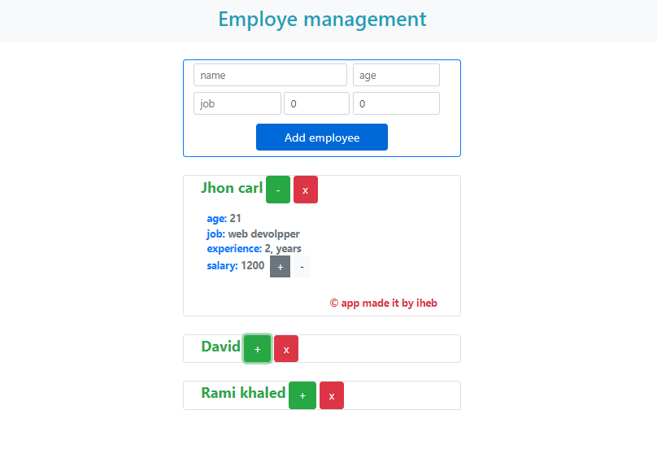

# SvelteJs-simple_app

<h3>simple app use svelte js to knwo the synthax is and how is looks like  and i really like it.</h3>

<h4>sveltejs  is not a framework not a library didn't use virtual dom, directives. svelteJs is a compiler use vanilla javacript. svelteJs have taken a more simplistic approach to state management.</4>

